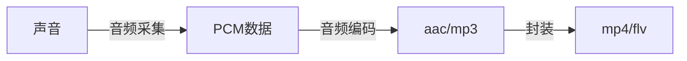
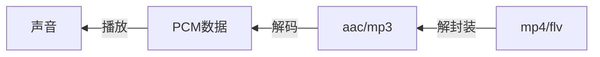
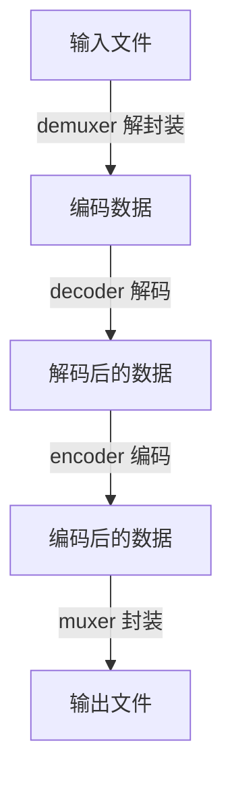

# 一、ffmpeg基础

## 1. ffmpeg介绍

ffmpeg既是一款音视频编解码工具，也是一组音视频编解码开发组件。

ffmpeg提供了多种媒体格式的封装和解封装，包括多种音视频编码、多种协议的流媒体、多种色彩格式转换、多种采样率转换、多种码率转换等。同时ffmpeg框架提供了多种插件模块，包含封装和解封装的插件、编码和解码的插件等。

ffmpeg框架由5个基本模块组成。  

- 封装模块：AVFormat
- 编解码模块：AVCodec
- 滤镜模块：AVFilter
- 视频图像转换模块：swscale
- 音频转换模块：swresample

ffmpeg提供了如下3个工具。

- 编解码工具：ffmpeg
- 播放器：ffplay
- 多媒体分析器：ffprobe

## 2. 如何安装ffmpeg

下面以ubuntu为例，说明如何安装ffmpeg

### 2.1 源码编译ffmpeg

**ubuntu发行版中已经包含了ffmpeg的安装包，但是可能版本比较老，对于一些新的编码格式和协议格式可能不支持，所以尽可能手动编译ffmpeg。**

默认编译FFmpeg时，需要用到**yasm汇编器**对ffmpeg中的汇编部分进行编译。如果不需要用到汇编部分的代码，可以不安装yasm汇编器。如果没有安装该汇编器，执行默认配置的时候会报错。

```shell
michael@ubuntu:~/ffmpeg/package$ ./configure 
nasm/yasm not found or too old. Use --disable-x86asm for a crippled build.

If you think configure made a mistake, make sure you are using the latest
version from Git.  If the latest version fails, report the problem to the
ffmpeg-user@ffmpeg.org mailing list or IRC #ffmpeg on irc.freenode.net.
Include the log file "ffbuild/config.log" produced by configure as this 
will help solve the problem.
```

1. 编译安装yasm

   ```shell
   wget http://www.tortall.net/projects/yasm/releases/yasm-1.3.0.tar.gz
   ./configure 
   sudo make 
   sudo make install
   ```

2. 安装xorg-dev和SDL这两个库（缺少这两个库，无法编译出ffplay）

   注意：旧版本ffplay依赖于SDL 1.2，而新版本依赖于SDL 2.0，需要安装对应的SDL才能编译生成ffplay

   ```shell
   sudo apt-get install xorg-dev
   sudo apt-get install libsdl2-dev
   ```

3. 安装libfdk_aac、libopus、libx264（如果编译选项中，用到了--enable-libfdk-aac）

   注：使用--enable-libfdk-aac编译选项时，需要先安装fdk_aac，否则会报 ERROR: libfdk_aac not found的错误，原因是fdk_aac已经从ffmpeg中独立出来了，所以需要先安装fdk_aac。同理，libopus和libx264也是一样
   
   ```shell
   sudo apt install libfdk-aac-dev
   sudo apt install libopus-dev
   sudo apt install libx264-dev
   ```

4. 编译安装ffmpeg（ffmpeg源码可以到官网上下载，git下载比较慢）

   注：--enable-shared 指定编译动态库，使用静态库编码的时候会报undefined reference的错误

   ```shell
   git clone git://source.ffmpeg.org/ffmpeg.git ffmpeg
   ./configure --enable-shared --prefix=/usr/local/ffmpeg --enable-gpl --enable-nonfree --enable-libfdk-aac
   sudo make
   sudo make install
   ```

5. 安装完成后，将ffmpeg的安装路径，添加到PATH环境变量

   ```shell
   sudo vi /etc/profile
   添加 export PATH=$PATH:/usr/local/ffmpeg/bin
   sudo source /etc/profile
   ```

   

**可能遇到的问题**

1. 安装完成，执行ffmpeg，可能会遇到下面的报错

   ```shell
   /usr/local/ffmpeg/bin/ffmpeg: error while loading shared libraries: libavdevice.so.59: cannot open shared object file: No such file or directory
   ```

   解决方法：

   ```shell
   sudo vi /etc/ld.so.conf
   在文件中添加路径：/usr/local/ffmpeg/lib   #该目录是ffmpeg的安装目录，根据个人不同安装目录修改。
   sudo ldconfig
   ```


**ffplay与ffplay_g的区别**

编译之后会发现，文件夹中同时出现了ffplay与ffplay_g（还有ffmpeg与ffmpeg_g）。这个多出来的g是做什么的呢？

实际上，ffplay_g是含有调试信息的可执行文件，当我们想要调试时（比如新建一个工程对源码进行调试）会需要到它，而一般来说在实际使用的时候，我们会使用ffplay，它是ffplay_g经过strip之后得到的文件

### 2.2 apt安装ffmeg

1. 添加源

   ```shell
   sudo add-apt-repository ppa:djcj/hybrid
   ```

2. 更新源

   ```shell
   sudo apt-get update
   ```

3. 下载ffmpeg

   ```shell
   sudo apt-get install ffmpeg
   ```

4. 查看ffmpeg安装路径和基本信息

   ```shell
   michael@ubuntu:~/ffmpeg$ whereis ffmpeg
   ffmpeg: /usr/bin/ffmpeg /usr/share/ffmpeg /usr/share/man/man1/ffmpeg.1.gz
   michael@ubuntu:~$ ffmpeg
   ffmpeg version 2.8.15-0ubuntu0.16.04.1 Copyright (c) 2000-2018 the FFmpeg developers
     *****省略多余信息*****
   Use -h to get full help or, even better, run 'man ffmpeg'
   ```

### 2.3 卸载ffmpeg

用源码的方式安装，使用如下方式卸载

```shell
cd ffmpeg
sudo make uninstall // 删除make install安装的文件
sudo make distclean // 删除configure和make产生的临时文件
```

用apt方式安装，使用如下方式卸载

```shell
sudo apt-get --purge remove ffmpeg
suod apt-get --purge autoremove
```

# 二、音频基础

## 1. 音频处理流程

采集到的音频数据是PCM数据，是转换后的数字信号

声音的采集过程：



声音的播放流程：



## 2. 声音的产生

声音是由物体振动产生的，可以通过气体、液体、固体等介质传递。

声音进入耳朵，使耳膜振动，大脑对其进行识别。

人的听觉范围是**20~2wHz**，这个范围内的声音称为**可听声波**；小于20Hz的称为**次声波**，超过2wHz的称为**超声波**。Hz是频率的单位，指1s内振动的次数。

## 3. 声音三要素

- 音量：振动的幅度
- 音调：音频的快慢
- 音色：由谐波产生

## 4. 模数转换

自然界中采集到的声音是模拟信号，对声音进行量化采样，将模拟信号转换为数字信号。

## 5. PCM和WAV

PCM是音频原始数据，纯音频数据。WAV是微软制定的一种音频文件格式，是在PCM数据的基础上，增加了一个头部信息。

WAV文件格式如下，头部信息中，比较重要的信息都音频格式、采样率、采样大小、声道数


**音频三要素**

- 采样大小（位深）：一个采样数据用多少bit存储，位深越大，表示音频范围越大。常用的是16bit
- 采样率：常用的有8K、16K、32K、44.1K、48K，采样率越大，数字信号就越接近于模拟信号，数据量也越大
- 声道数：单声道、双声道、多声道

```
码率 = 采样率 * 采样大小 * 声道数
```

例如，采样率44.1KHz，采样大小16bit，双声道的PCM编码的WAV文件，它的码率是多少？

码率 = 44.1K * 16 * 2 = 1411.2 Kb/s

## 6. 音频采集

对于音频采集，不同的平台，如android、ios、windows和mac，有不同的API可供调用。而FFmpeg对于这些平台都做了封装，不需要区分具体平台，所以掌握ffmpeg的音频采集方式很重要。

### 6.1 命令行方式

```shell
ffmpeg -f alsa -i hw:0,0 out.wav  // 用ffmpeg采集音频数据。-f指定用到的库，alsa是采集音频的库
ffplay out.wav					  // ffplay播放保存的音频文件
```

### 6.2 API方式

ffmpeg音频采集方式


采集音频步骤

 ```mermaid
graph LR

A[注册音频设备] --> B[设置采集方式]
B --> C[打开音频设备]
 ```

## 7. 音频压缩技术

音频压缩主要考虑两方面，**压缩后的数据量**和**压缩速度**，直播需要综合考虑这两个方面

音频压缩技术分为有损压缩和无损压缩。无损压缩还原后，和原数据完全相同；有损压缩还原后，和原数据略有不同

### 7.1有损压缩

低于20Hz和高于20000Hz的数据，人耳感知不到，可以去除。

遮蔽效应，时间遮蔽和频域遮蔽，声音会被掩盖，也可以去除。

### 7.2 无损压缩

熵编码

- 哈夫曼编码
- 算术编码
- 香农编码

## 8. 常见的音频编码器

- **OPUS**：延迟小、压缩率高，是比较新的音频编解码器，webrtc中默认使用OPUS

- **AAC**：在直播中应用比较广泛，应用最广泛，音质保真性好。目的是取代MP3格式，压缩率更好，保真性好

- Ogg：收费

- Speex：支持回音消除

- G.711：用于固话，窄带音频，声音损耗严重

  评测结果：OPUS > AAC > Ogg

  


### 8.1 AAC编码器

**常用的规格：**

- AAC LC：最基础的版本，低复杂度，码率在128Kb/s，音质好
- HE-AAC：在AAC LC基础上，增加了SBR技术，码率在64Kb/s左右。核心思想是按频谱分类保存，低频保存主要成分，高频单独放大编码保存音质  
- HE-AACv2：在HE-AAC基础上，增加了PS技术，码率在48Kb/s左右。核心思想是双声道中的声音存在某种相似性，只需存储一个声道的全部信息，然后用很少的字节保存另一个声道和它不同的地方

**AAC格式**

- ADIF：头部保存的音频的重要信息，只能从头开始编码，不能从音频数据的中间开始。常用在磁盘文件中
- ADTS：每一帧都有一个同步字，可以在音频的任何位置开始解码 


从mp4文件中提取音频文件，使用AAC编码。具体参数说明，见官方文档：https://ffmpeg.org/ffmpeg-codecs.html#libfdk_005faac

```shell
ffmpeg -i xxx.mp4 -vn -c:a libfdk_aac -ar 44100 -channels 2 -profile:a aac_he_v2 v2.aac
// 1. -i：表示输入文件
// 2. -vn：video no，表示过滤视频
// 3. -c:a：-c表示code编码，a表示audio音频，表示使用fdk_aac编码器
// 4. -ar：表示音频采样率
// 5. -channels：表示声道数，双声道
// 6. -profile:a：表示设置音频参数，aac_he_v2，以AAC HE V2规格来编码
```

### 8.2 opus编码器

## 9. 音频重采样

音频三元组

- 采样率
- 采样大小
- 通道数

### 9.1 什么是音频重采样

指的是将音频三元组的值转换成另一组值，如将44100 / 16 / 2 转换成48000 / 16 / 2

### 9.2 为什么要进行重采样？

- 从设备采集的数据和编码器要求的数据不一致
- 扬声器要求的音频数据和要播放的数据不一致
- 便于计算

### 9.3 如何判断是否要进行重采样

- 了解音频设备的参数

```shell
machun@ubuntu:~/ffmpeg_learn$ lspci |grep -i audio  	// 查看声卡型号
02:02.0 Multimedia audio controller: Ensoniq ES1371/ES1373 / Creative Labs CT2518 (rev 02)
machun@ubuntu:~/ffmpeg_learn$ cat /proc/asound/cards    // 查看声卡信息
 0 [AudioPCI       ]: ENS1371 - Ensoniq AudioPCI
                      Ensoniq AudioPCI ENS1371 at 0x2040, irq 16
machun@ubuntu:~/ffmpeg_learn$ aplay -l					// 查看声卡详细信息
**** List of PLAYBACK Hardware Devices ****
card 0: AudioPCI [Ensoniq AudioPCI], device 0: ES1371/1 [ES1371 DAC2/ADC]
  Subdevices: 0/1
  Subdevice #0: subdevice #0
card 0: AudioPCI [Ensoniq AudioPCI], device 1: ES1371/2 [ES1371 DAC1]
  Subdevices: 1/1
  Subdevice #0: subdevice #0
```

- 查看ffmpeg源码

### 9.4 重采样步骤

- 创建重采样上下文
- 设置参数
- 初始化重采样
- 进行重采样

## 10. 创建音频编码器

ffmpeg编码过程


# 三、视频基础

视频是由图像组成

## 1. 图像的基本概念

### 1.1 像素

视频是由图像组成，图像是由**像素**组成，像素由红（R）、绿（G）、蓝（B）三原色组成。

图像是数据，屏幕是显示设备。数据经过驱动程序的渲染，在屏幕上显示图像

### 1.2 RGB和BGR

RGB和BGR是两种不同的格式，对应的三原色排列顺序不同，因此图像效果也是不一样的。大部分图像使用的是RGB格式，但BMP使用的是BGR格式，驱动程序无法识别给的数据是RGB还是BGR格式，统一按照RGB渲染。所以如果不做格式转换直接显示，图像是有问题的。因此BMP格式打开需要先做格式转换

### 1.3 分辨率

**分辨率**指图像是由多少个像素点组成，分辨率 = X轴的像素个数 * Y轴的像素个数。常见的有：1280 * 720（720P）、1920 * 1080（1080P）、2048 * 1080（2K）、3840 * 2160（4K）。描述分辨率的单位有：**ppi**（每英寸的像素数量）、**dpi**（每英寸的点数），大部分情况下，ppi = dpi。ppi越高，图像就越细腻。照片大约为300 ppi

## 2. 码流的计算

### 2.1 帧率

每秒采集或播放图像的个数。

动画的帧率是25帧/s，常见的帧率有：15帧/s，30帧/s，60帧/s。对于实时通信而言，为了保证数据的实时性，可以将帧率设置为15帧/s。

**帧率越高，视频播放越平滑；分辨率影响图像的清晰度**

未编码的RGB码流大小 = 分辨率（宽 * 高） * 3（Byte）* 帧率

### 2.2 压缩率

H264 码流压缩率大约为250倍，H265 码流压缩率大约为500倍

### 2.3 宽高比

常见的宽高比有16:9 和 4:3。目前几乎都是16:9，如果宽高比不是16:9 或 4:3，需要将其转换为标准的16:9 或 4:3

## 3. 图像的显示

图像的显示，需要考虑图像大小和显示窗口大小的关系。

- 图像大小 == 显示窗口大小，刚好显示
- 图像大小 < 显示窗口大小，可以进行拉伸或留白
- 图像大小 > 显示窗口大小，可以进行缩小或截取

## 4. YUV

### 4.1 介绍

YUV也称YCbCr，Y表示亮度，UV描述色彩和饱和度

### 4.2 YUV格式

主要格式有 

- YUV  4 : 4 : 4


- YUV  4 : 2 : 2


- YUV  4 : 2 : 0


### 4.3 YUV 和 RGB的关系

- YUV用于图像的采集和编码
- RGB用于图像的展示

### 4.4 YUV转RGB

```
R = Y + 1.140 * V
G = Y - 0.394 * U - 0.581 * V
B = Y + 2.032 * U
```

## 5. H264

### 5.1 压缩比

### 5.2 GOP

Group Of Picture，将相差比较小的一系列图片分成一组，组内桢与桢之间的差别很小

### 5.3 I帧、P帧、B帧

### 5.4 宏块

### 5.5 帧内压缩

桢内压缩的理论基础：

- 相邻像素差别不大，可进行宏块预测
- 人对亮度的敏感度超过色度
- YUV很容易将亮度和色度分开

### 5.6 帧间压缩

### 5.7 无损压缩

### 5.8 H264码流结构

# 四、ffmpeg命令

## 1. 命令分类

- 基本信息查询命令
- 录制命令
- 分解 & 复用命令（格式转换）
- 处理原始数据命令
- 裁剪与合并命令
- 图片与视频转换命令
- 直播命令
- 滤镜命令

## 2. ffmpeg处理音视频流程



## 3. 基本信息查询命令

| 命令         | 说明                          |
| :----------- | :---------------------------- |
| -version     | 查看版本                      |
| -demuxers    | 查看可用的解封装器（demuxer） |
| -muxers      | 查看可用的封装器（muxer)      |
| -devices     | 查看可用的设备                |
| -codecs      | 查看可用的编解码器            |
| -decoders    | 查看可用的解码器              |
| -encoders    | 查看可用的编码器              |
| -bsfs        | 查看比特流 filter             |
| -formats     | 查看可用的格式                |
| -protocols   | 查看可用的协议                |
| -filters     | 查看可用的滤镜                |
| -pix_fmts    | 查看可用的像素格式            |
| -sample_fmts | 查看可用的采样格式            |
| -layouts     | 查看channel名称               |
| -colors      | 查看颜色名称                  |

## 4. ffmpeg支持的设备

**详细资料请参考**：[FFmpeg Devices Documentation](http://www.ffmpeg.org/ffmpeg-devices.html)

ffmpeg 在 linux下支持多种采集设备，查看支持的设备列表

```shell
machun@ubuntu:~/ffmpeg_learn$ ffmpeg -hide_banner -devices
Devices:
 D. = Demuxing supported
 .E = Muxing supported
 --
 DE alsa            ALSA audio output
 DE fbdev           Linux framebuffer
 D  lavfi           Libavfilter virtual input device
 DE oss             OSS (Open Sound System) playback
  E sdl,sdl2        SDL2 output device
 DE sndio           sndio audio playback
 DE video4linux2,v4l2 Video4Linux2 output device
  E xv              XV (XVideo) output device
```

- 输入设备（demuxer）：alsa、fbdev、lavfi、oss、sndio、v4l2
- 输出设备（muxer）：alsa、fbdev、oss、sdl、sdl2、sndio、v4l2、xv

### 4.1 v4l2

用于采集摄像头数据，设备对应的文件是 /dev/video0

### 4.2 alsa 

音频采集设备，要想使用这个设备，必须先安装libasound库。ubuntu下执行下面命令

```shell
sudo apt install libasound2-dev
```

alsa输入设备命名规则如下，其中DEV和SUBDEV是可选的

```tex
hw:card[,DEV[,SUBDEV]]
```

查看系统支持的cards列表

```shell
machun@ubuntu:~/ffmpeg_learn$ cat /proc/asound/cards 
 0 [AudioPCI       ]: ENS1371 - Ensoniq AudioPCI
                      Ensoniq AudioPCI ENS1371 at 0x2040, irq 16
machun@ubuntu:~/ffmpeg_learn$ cat /proc/asound/devices 
  1:        : sequencer
  2: [ 0- 0]: digital audio playback
  3: [ 0- 0]: digital audio capture
  4: [ 0- 1]: digital audio playback
  5: [ 0- 0]: raw midi
  6: [ 0]   : control
 33:        : timer
```

使用如下命令可以通过 alsa 采集音频数据

```shell
ffmpeg -f alsa -i hw:0 alsaout.wav
```

常用选项

```tex
-sample_rate：设置采样率，默认48K
-channels：设置通道数，默认双通道
```

### 4.3 x11grab

用于采集桌面数据

### 4.4 fbdev

用于采集终端数据，设备对应的文件是 /dev/fb0

```shell
machun@ubuntu:~/ffmpeg_learn$ ffmpeg -hide_banner -h demuxer=fbdev
Demuxer fbdev [Linux framebuffer]:
fbdev indev AVOptions:
  -framerate         <video_rate> .D.........  (default "25")    // 采集视频时的刷新帧率，默认25帧
machun@ubuntu:~/ffmpeg_learn$ ffmpeg -hide_banner -h muxer=fbdev
Muxer fbdev [Linux framebuffer]:
    Default video codec: rawvideo.
fbdev outdev AVOptions:
  -xoffset           <int>        E.......... set x coordinate of top left corner (from INT_MIN to INT_MAX) (default 0)
  -yoffset           <int>        E.......... set y coordinate of top left corner (from INT_MIN to INT_MAX) (default 0)
```

有时想向外界展示linux命令行，又不希望别人看你的桌面，可以通过 FrameBuffer进行编码，然后推流或录制

```shell
ffmpeg -framerate 30 -f fbdev -i /dev/fb0 out.wav
```

上述命令执行后，linux会获取终端中的图像，而不是图形界面的图像

## 5. 录制命令

**录制桌面**

```shell
ffmpeg -f x11grab -s 1920x1080 -r 25 -i :0.0+0+0 luping.mp4
```

- -f：指定使用哪个库
- -i：指定从哪儿采集数据，是一个文件索引
- -r：指定帧率

5.2 摄像头

5.3 麦克风

5.4 摄像头 + 麦克风

5.5 桌面 + 麦克风

## 6. 格式转换

即分解与复用


**用ffmpeg进行格式转换**

```shell
ffmpeg -i in.mp4 -vcodec copy -acodec copy out.flv
```

- -i：输入文件
- -vcodec copy：视频编码处理方式，copy即复制
- -acodec copy：音频编码处理方式，copy即复制


**用ffmpeg单独提取视频**

```shell
ffmpeg -i in.mp4 -an -vcodec copy out.h264
```

- -an：不处理音频


**用ffmpeg单独提取音频**

```shell
ffmpeg -i in.mp4 -vn -acodec copy out.aac
```

- -vn：不处理视频


**注意：如果输入文件中没有音频，要提取音频就会报错；同理，没有视频，要提取视频也会报错**

## 7. 提取原始数据

视频原始数据是 YUV 数据，音频原始数据是 PCM 数据

### 7.1 提取YUV数据

```shell
ffmpeg -i short_mv.mp4 -an -c:v rawvideo -pix_fmt yuv420p out.yuv
```

- -c:v rawvideo：对视频进行编码，编码格式是 rawvideo，原始数据
- -pix_fmt：指定像素格式，yuv420p


该mp4文件长度为20s，对比提取出来的YUV数据，以及mp4文件，可见文件大小差距之大。


播放YUV数据时，需要指定分辨率，否则播放不出来。分辨率可以在提取时的输出信息中查看


### 7.2 提取PCM数据

```shell
ffmpeg -i short_mv.mp4 -vn -ar 44100 -ac 2 -f s16le out.pcm
```

- -ar：audio rate，音频采样率
- -ac：audio channel，指定声道数
- -f：音频数据存储格式，s16le（s表示有符号，16表示16位，le表示little endian，小端存储）


播放原始数据，也需要指定采样率、声道数、存储格式信息，才能正确播放


## 8. 裁剪与拼接

### 8.1 音视频裁剪

```shell
ffmpeg -i input.mp4 -ss 00:01:20 -t 20 out.mp4
```

- -ss：指定从视频的什么位置开始裁剪，1分20秒开始
- -t：裁剪的时间，单位s

### 8.2 音视频拼接

```shell
ffmpeg -f concat -i inputs.txt out.mp4
```

- -f concat：表示要拼接视频

- inputs.txt 为要拼接的文件列表，文件名的先后顺序指定视频的先后顺序。文件内容为 file 'filename' 格式


将1.mp4和2.mp4合并，合成后的文件，1.mp4在前，2.mp4在后

```shell
machun@ubuntu:~/ffmpeg_learn$ cat inputs.txt 
file '1.mp4'
file '2.mp4'
machun@ubuntu:~/ffmpeg_learn$ ffmpeg -f concat -i inputs.txt 3.mp4
```

## 9. 图片和视频互转

### 9.1 视频转图片

```shell
ffmpeg -i input.flv -r 1 -f image2 image-%3d.jpeg
```

- -r：表示转换图片的帧率，每秒转换出1张图片

- -f：指定转换后的图片格式，image2

- image-%3d.jpeg：转换后的文件名，%3d是格式化输出

  

**转换后的结果如下**


### 9.2 图片转视频

```shell
ffmpeg -i image-%3d.jpeg out.mp4
```

如果按照上面的方式转，是默认按照25帧每秒来转换。

设置图片按照固定的帧率转换为视频

```shell
ffmpeg -i image-%3d.jpeg  -r 10 out.mp4
```

设置图片切换帧率为每秒1张图片。注意 -r 1的顺序，放到后面转换后的视频时长不对

```shell
ffmpeg -r 1 -i image-%02d.jpeg -vf fps=1 out.mp4
```

图片转视频，还可以设置分辨率信息

## 10. 直播推拉流


# 五、编解码格式

# 六、封装格式

# 七、流媒体协议

# 八、webrtc


