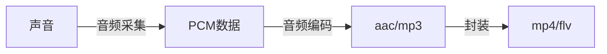
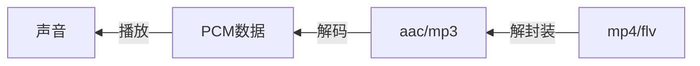
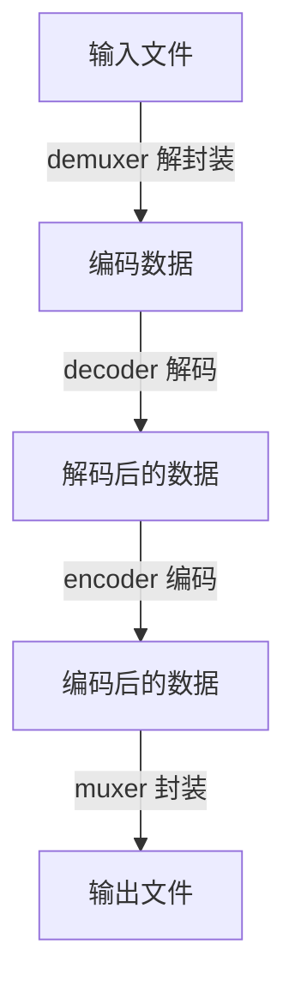

# 招聘大致要求

1. 熟悉C/C++，熟悉STL
2. 熟悉常用数据结构和算法
3. 熟悉网络基本原理，熟悉TCP/IP协议
4. 熟悉FFmpeg、webrtc、librtmp、SDL、opencv、libyuv，有实际使用经验
5. 熟悉常见的音视频编解码协议和封装格式，如H264、H265、mjpeg、mp4、avi、ps、ts、aac、opus等
6. 熟悉网络流媒体协议，如rtp、rtsp、rtmp、hls、onvif
7. 有ios、mac、android、linux、windows至少一个平台的开发经验，熟悉系统相关的API


# 待办事项

- [ ] FFmpeg录制命令
- [ ] FFmpeg滤镜命令
- [ ] RGB格式
- [ ] 视频编码格式
  - [x] H264
  - [ ] MPEG
- [ ] 封装格式
  - [x] MP4
  - [x] FLV
  - [ ] TS
- [ ] 音频编码格式
  - [ ] AAC
  - [ ] MP3
- [ ] 流媒体协议
  - [ ] RTMP
  - [ ] RTSP
  - [ ] HTTP
  - [ ] RTP
  - [ ] RTCP


# 一、ffmpeg基础

## 1. ffmpeg介绍

ffmpeg既是一款音视频编解码工具，也是一组音视频编解码开发组件。

ffmpeg提供了多种媒体格式的封装和解封装，包括多种音视频编码、多种协议的流媒体、多种色彩格式转换、多种采样率转换、多种码率转换等。同时ffmpeg框架提供了多种插件模块，包含封装和解封装的插件、编码和解码的插件等。

ffmpeg框架由5个基本模块组成。  

- 封装模块：AVFormat
- 编解码模块：AVCodec
- 滤镜模块：AVFilter
- 视频图像转换模块：swscale
- 音频转换模块：swresample

ffmpeg提供了如下3个工具。

- 编解码工具：ffmpeg
- 播放器：ffplay
- 多媒体分析器：ffprobe

## 2. 如何安装ffmpeg

> 下面以ubuntu为例，说明如何安装ffmpeg

### 2.1 源码编译ffmpeg

**ubuntu发行版中已经包含了ffmpeg的安装包，但是可能版本比较老，对于一些新的编码格式和协议格式可能不支持，所以尽可能手动编译ffmpeg。**

默认编译FFmpeg时，需要用到**yasm汇编器**对ffmpeg中的汇编部分进行编译。如果不需要用到汇编部分的代码，可以不安装yasm汇编器。如果没有安装该汇编器，执行默认配置的时候会报错。

```shell
michael@ubuntu:~/ffmpeg/package$ ./configure 
nasm/yasm not found or too old. Use --disable-x86asm for a crippled build.

If you think configure made a mistake, make sure you are using the latest
version from Git.  If the latest version fails, report the problem to the
ffmpeg-user@ffmpeg.org mailing list or IRC #ffmpeg on irc.freenode.net.
Include the log file "ffbuild/config.log" produced by configure as this 
will help solve the problem.
```

1. 编译安装yasm

   ```shell
   wget http://www.tortall.net/projects/yasm/releases/yasm-1.3.0.tar.gz
   ./configure 
   sudo make 
   sudo make install
   ```

2. 安装xorg-dev和SDL这两个库（缺少这两个库，无法编译出ffplay）

   注意：旧版本ffplay依赖于SDL 1.2，而新版本依赖于SDL 2.0，需要安装对应的SDL才能编译生成ffplay

   ```shell
   sudo apt-get install xorg-dev
   sudo apt-get install libsdl2-dev
   ```

3. 安装libfdk_aac、libopus、libx264（如果编译选项中，用到了--enable-libfdk-aac）

   注：使用--enable-libfdk-aac编译选项时，需要先安装fdk_aac，否则会报 ERROR: libfdk_aac not found的错误，原因是fdk_aac已经从ffmpeg中独立出来了，所以需要先安装fdk_aac。同理，libopus和libx264也是一样
   
   ```shell
   sudo apt install libfdk-aac-dev
   sudo apt install libopus-dev
   sudo apt install libx264-dev
   ```

4. 编译安装ffmpeg（ffmpeg源码可以到官网上下载，git下载比较慢）

   注：--enable-shared 指定编译动态库，使用静态库编码的时候会报undefined reference的错误

   ffmpeg常用配置：[ffmpeg configure配置选项_一个人像一支队伍-CSDN博客](https://blog.csdn.net/momo0853/article/details/78043903)

   ```shell
   git clone git://source.ffmpeg.org/ffmpeg.git ffmpeg
   sudo ./configure --enable-shared --prefix=/usr/local/ffmpeg --enable-gpl --enable-nonfree --enable-libfdk-aac --enable-libx264 --enable-libmp3lame --enable-libfreetype --enable-libfontconfig --enable-libfribidi --enable-libass
   sudo make -j16
   sudo make install
   ```

5. 安装完成后，将ffmpeg的安装路径，添加到PATH环境变量

   ```shell
   sudo vi /etc/profile
   添加 export PATH=$PATH:/usr/local/ffmpeg/bin
   sudo source /etc/profile
   ```


**可能遇到的问题**

1. 安装完成，执行ffmpeg，可能会遇到下面的报错

   ```shell
   /usr/local/ffmpeg/bin/ffmpeg: error while loading shared libraries: libavdevice.so.59: cannot open shared object file: No such file or directory
   ```

   解决方法：

   ```shell
   sudo vi /etc/ld.so.conf
   在文件中添加路径：/usr/local/ffmpeg/lib   #该目录是ffmpeg的安装目录，根据个人不同安装目录修改。
   sudo ldconfig
   ```


**ffplay与ffplay_g的区别**

编译之后会发现，文件夹中同时出现了ffplay与ffplay_g（还有ffmpeg与ffmpeg_g）。这个多出来的g是做什么的呢？

实际上，ffplay_g是含有调试信息的可执行文件，当我们想要调试时（比如新建一个工程对源码进行调试）会需要到它，而一般来说在实际使用的时候，我们会使用ffplay，它是ffplay_g经过strip之后得到的文件

### 2.2 apt安装ffmeg

1. 添加源

   ```shell
   sudo add-apt-repository ppa:djcj/hybrid
   ```

2. 更新源

   ```shell
   sudo apt-get update
   ```

3. 下载ffmpeg

   ```shell
   sudo apt-get install ffmpeg
   ```

4. 查看ffmpeg安装路径和基本信息

   ```shell
   michael@ubuntu:~/ffmpeg$ whereis ffmpeg
   ffmpeg: /usr/bin/ffmpeg /usr/share/ffmpeg /usr/share/man/man1/ffmpeg.1.gz
   michael@ubuntu:~$ ffmpeg
   ffmpeg version 2.8.15-0ubuntu0.16.04.1 Copyright (c) 2000-2018 the FFmpeg developers
     *****省略多余信息*****
   Use -h to get full help or, even better, run 'man ffmpeg'
   ```

### 2.3 卸载ffmpeg

用源码的方式安装，使用如下方式卸载

```shell
cd ffmpeg
sudo make uninstall // 删除make install安装的文件
sudo make distclean // 删除configure和make产生的临时文件
```

用apt方式安装，使用如下方式卸载

```shell
sudo apt-get --purge remove ffmpeg
suod apt-get --purge autoremove
```

# 二、音频基础

## 1. 音频处理流程

采集到的音频数据是PCM数据，是转换后的数字信号

声音的采集过程：



声音的播放流程：



## 2. 声音的产生

声音是由物体振动产生的，可以通过气体、液体、固体等介质传递。

声音进入耳朵，使耳膜振动，大脑对其进行识别。

人的听觉范围是**20~2wHz**，这个范围内的声音称为**可听声波**；小于20Hz的称为**次声波**，超过2wHz的称为**超声波**。Hz是频率的单位，指1s内振动的次数。

## 3. 声音三要素

- 音量：振动的幅度
- 音调：音频的快慢
- 音色：由谐波产生

## 4. 模数转换

自然界中采集到的声音是模拟信号，对声音进行量化采样，将模拟信号转换为数字信号。

## 5. PCM和WAV

PCM是音频原始数据，纯音频数据。WAV是微软制定的一种音频文件格式，是在PCM数据的基础上，增加了一个头部信息。

WAV文件格式如下，头部信息中，比较重要的信息都音频格式、采样率、采样大小、声道数


**音频三要素**

- 采样大小（位深）：一个采样数据用多少bit存储，位深越大，表示音频范围越大。常用的是16bit
- 采样率：常用的有8K、16K、32K、44.1K、48K，采样率越大，数字信号就越接近于模拟信号，数据量也越大
- 声道数：单声道、双声道、多声道

```
码率 = 采样率 * 采样大小 * 声道数
```

例如，采样率44.1KHz，采样大小16bit，双声道的PCM编码的WAV文件，它的码率是多少？

码率 = 44.1K * 16 * 2 = 1411.2 Kb/s

## 6. 音频采集

对于音频采集，不同的平台，如android、ios、windows和mac，有不同的API可供调用。而FFmpeg对于这些平台都做了封装，不需要区分具体平台，所以掌握ffmpeg的音频采集方式很重要。

### 6.1 命令行方式

```shell
ffmpeg -f alsa -i hw:0 out.wav  // 用ffmpeg采集音频数据。-f指定用到的库，alsa是采集音频的库
ffplay out.wav					  // ffplay播放保存的音频文件
```

### 6.2 API方式

ffmpeg音频采集方式


采集音频步骤

 ```mermaid
graph LR

A[注册音频设备] --> B[设置采集方式]
B --> C[打开音频设备]
 ```

## 7. 音频压缩技术

音频压缩主要考虑两方面，**压缩后的数据量**和**压缩速度**，直播需要综合考虑这两个方面

音频压缩技术分为有损压缩和无损压缩。无损压缩还原后，和原数据完全相同；有损压缩还原后，和原数据略有不同

### 7.1有损压缩

低于20Hz和高于20000Hz的数据，人耳感知不到，可以去除。

遮蔽效应，时间遮蔽和频域遮蔽，声音会被掩盖，也可以去除。

### 7.2 无损压缩

熵编码

- 哈夫曼编码
- 算术编码
- 香农编码

## 8. 常见的音频编码器

- **OPUS**：延迟小、压缩率高，是比较新的音频编解码器，webrtc中默认使用OPUS

- **AAC**：在直播中应用比较广泛，应用最广泛，音质保真性好。目的是取代MP3格式，压缩率更好，保真性好

- Ogg：收费

- Speex：支持回音消除

- G.711：用于固话，窄带音频，声音损耗严重

  评测结果：OPUS > AAC > Ogg

  


### 8.1 AAC编码器

**常用的规格：**

- AAC LC：最基础的版本，低复杂度，码率在128Kb/s，音质好
- HE-AAC：在AAC LC基础上，增加了SBR技术，码率在64Kb/s左右。核心思想是按频谱分类保存，低频保存主要成分，高频单独放大编码保存音质  
- HE-AACv2：在HE-AAC基础上，增加了PS技术，码率在48Kb/s左右。核心思想是双声道中的声音存在某种相似性，只需存储一个声道的全部信息，然后用很少的字节保存另一个声道和它不同的地方

**AAC格式**

- ADIF：头部保存的音频的重要信息，只能从头开始编码，不能从音频数据的中间开始。常用在磁盘文件中
- ADTS：每一帧都有一个同步字，可以在音频的任何位置开始解码 


从mp4文件中提取音频文件，使用AAC编码。具体参数说明，见官方文档：https://ffmpeg.org/ffmpeg-codecs.html#libfdk_005faac

```shell
ffmpeg -i xxx.mp4 -vn -c:a libfdk_aac -ar 44100 -channels 2 -profile:a aac_he_v2 v2.aac
// 1. -i：表示输入文件
// 2. -vn：video no，表示过滤视频
// 3. -c:a：-c表示code编码，a表示audio音频，表示使用fdk_aac编码器
// 4. -ar：表示音频采样率
// 5. -channels：表示声道数，双声道
// 6. -profile:a：表示设置音频参数，aac_he_v2，以AAC HE V2规格来编码
```

### 8.2 opus编码器

## 9. 音频重采样

音频三元组

- 采样率
- 采样大小
- 通道数

### 9.1 什么是音频重采样

指的是将音频三元组的值转换成另一组值，如将44100 / 16 / 2 转换成48000 / 16 / 2

### 9.2 为什么要进行重采样？

- 从设备采集的数据和编码器要求的数据不一致
- 扬声器要求的音频数据和要播放的数据不一致
- 便于计算

### 9.3 如何判断是否要进行重采样

- 了解音频设备的参数

```shell
machun@ubuntu:~/ffmpeg_learn$ lspci |grep -i audio  	// 查看声卡型号
02:02.0 Multimedia audio controller: Ensoniq ES1371/ES1373 / Creative Labs CT2518 (rev 02)
machun@ubuntu:~/ffmpeg_learn$ cat /proc/asound/cards    // 查看声卡信息
 0 [AudioPCI       ]: ENS1371 - Ensoniq AudioPCI
                      Ensoniq AudioPCI ENS1371 at 0x2040, irq 16
machun@ubuntu:~/ffmpeg_learn$ aplay -l					// 查看声卡详细信息
**** List of PLAYBACK Hardware Devices ****
card 0: AudioPCI [Ensoniq AudioPCI], device 0: ES1371/1 [ES1371 DAC2/ADC]
  Subdevices: 0/1
  Subdevice #0: subdevice #0
card 0: AudioPCI [Ensoniq AudioPCI], device 1: ES1371/2 [ES1371 DAC1]
  Subdevices: 1/1
  Subdevice #0: subdevice #0
```

- 查看ffmpeg源码

### 9.4 重采样步骤

- 创建重采样上下文
- 设置参数
- 初始化重采样
- 进行重采样

## 10. 创建音频编码器

ffmpeg编码过程


# 三、视频基础

视频是由图像组成

## 1. 图像的基本概念

### 1.1 像素

视频是由图像组成，图像是由**像素**组成，像素由红（R）、绿（G）、蓝（B）三原色组成。

图像是数据，屏幕是显示设备。数据经过驱动程序的渲染，在屏幕上显示图像

### 1.2 分辨率

**分辨率**指图像是由多少个像素点组成，分辨率 = X轴的像素个数 * Y轴的像素个数。常见的有：1280 * 720（720P）、1920 * 1080（1080P）、2048 * 1080（2K）、3840 * 2160（4K）。描述分辨率的单位有：**ppi**（每英寸的像素数量）、**dpi**（每英寸的点数），大部分情况下，ppi = dpi。ppi越高，图像就越细腻。照片大约为300 ppi

## 2. 颜色空间之RGB

RGB分别表示红（R）、绿（G）、蓝（B）三原色，将他们以不同的比例混合，能得到各种不同的颜色。

一张1920 * 1080的图片，共有1920 * 1080个像素点。如果采用RGB编码方式，每个像素点用RGB表示，每个颜色占用8 比特，取值范围0 ~ 255，因此每个像素占3字节，那一张1920 * 1080的图片，占用的内存大小为 1920 * 1080 * 3 / 1024 / 1024 = 5.93 MB，占用的空间

RGB和BGR是两种不同的格式，对应的三原色排列顺序不同，因此图像效果也是不一样的。大部分图像使用的是RGB格式，但BMP使用的是BGR格式，驱动程序无法识别给的数据是RGB还是BGR格式，统一按照RGB渲染。所以如果不做格式转换直接显示，图像是有问题的。因此BMP格式打开需要先做格式转换

## 3. 颜色空间之YUV

参考链接：

- [一文理解 YUV - 知乎 (zhihu.com)](https://zhuanlan.zhihu.com/p/75735751)
- [一文读懂 YUV 的采样与格式 (qq.com)](https://mp.weixin.qq.com/s/KKfkS5QpwPAdYcEwFAN9VA)
- [对颜色空间YUV、RGB的理解_落花时节又逢君-CSDN博客](https://blog.csdn.net/asahinokawa/article/details/80596655)
- [YUV pixel formats (fourcc.org)](https://www.fourcc.org/yuv.php)

### 3.1 介绍

YUV格式使用亮度和色度表示每个像素的颜色。其中，Y表示亮度（Luma），UV（chroma）描述色调和饱和度。

提出YUV格式的原因，是为了解决彩色电视和黑白电视的兼容性问题。

用YUV表示的图像，可以将Y和UV分量分离。如果只有Y分量没有UV分量，图像就是黑白的。

人眼对于色度的敏感度小于对亮度的敏感度，因此减少一定的色度信息，人眼也不会察觉。根据这一点，可以在采样时，减少UV分量的采样，进而达到节省存储空间的目的

### 3.2 YUV采样格式

下图展示了三种采样的方式，其中黑点表示Y分量，空心圆表示UV分量。

- YUV 4:4:4 采样，每一个Y对应一组UV分量
- YUV 4:2:2 采样，每两个Y共用一组UV分量
- YUV 4:2:0 采样，每四个Y共用一组UV分量


#### 3.2.1 YUV  4 : 4 : 4


YUV 4:4:4采样，三个分量采样率相同，每个像素点都包含完整的Y、U、V分量，所以每个像素点占用3个字节。这种采样方式，图像大小和RGB一样，没有节省空间

```tex
假如图像像素为：[Y0 U0 V0] [Y1 U1 V1] [Y2 U2 V2] [Y3 U3 V3]
那么采样的数据为：Y0 U0 V0 Y1 U1 V1 Y2 U2 V2 Y3 U3 V3
最后映射出的像素点为：[Y0 U0 V0] [Y1 U1 V1] [Y2 U2 V2] [Y3 U3 V3]
```

#### 3.2.2 YUV  4 : 2 : 2


YUV 4:2:2采样，水平方向按照2:1的比例采样，即Y和UV分量比例为2:1，垂直方向完全采样。如果水平方向有8个像素点，则采样8个Y分量，4个UV分量。

```
假如图像像素为：[Y0 U0 V0] [Y1 U1 V1] [Y2 U2 V2] [Y3 U3 V3]
那么采样的数据为：Y0 U0 Y1 V1 Y2 U2 Y3 V3
其中，每个像素点都会采样其Y分量，而U、V分量会间隔一个采集一个

最后映射出的像素点为 [Y0 U0 V1] [Y1 U0 V1] [Y2 U2 V3] [Y3 U2 V3]
其中，第1个、第2个像素点，共用了U0和V1分量；第3个、第4个像素点，共用了U2和V3分量。因此，每2个像素点占用4个字节，相比于RGB和YUV 4:4:4采样，节省了1/3的数据量
```

#### 3.2.3 YUV  4 : 2 : 0


YUV 4:2:0采样，不是不采集V分量，而是每一行只采集一种色度分量（U或V），Y分量和色度分量按照2:1的比例采样。比如，第1行，Y和U分量按照2:1的比例采样；第2行，Y和V分量按照2:1的比例采样。所以需要扫描两行，才能获取完整的YUV分量

```
假如图像像素为：
[Y0 U0 V0] [Y1 U1 V1] [Y2 U2 V2] [Y3 U3 V3]
[Y4 U4 V4] [Y5 U5 V5] [Y6 U6 V6] [Y7 U7 V7]
那么采样的数据为：Y0 U0 Y1 Y2 U2 Y3 Y4 V4 Y5 Y6 V6 Y7
其中，每个像素点都会采集Y分量，每一行只会采集UV分量中的一种，而Y分量和色度分量的比例为2:1

最后映射出的像素点为：
[Y0 U0 V4] [Y1 U0 V4] [Y2 U2 V6] [Y3 U2 V6]
[Y4 U0 V4] [Y5 U0 V4] [Y6 U2 V6] [Y7 U2 V6]
其中，每2个像素点占用3个字节，所以相比于RGB和YUV 4:4:4采样，节省了1/2的数据量，这是比较主流的采样格式
```

### 3.4 YUV存储格式

存储格式，就是是采样的数据按照什么格式保存起来。

YUV 的存储格式有两种，

- 平面格式（planner formats）：先存储所有像素点的Y分量，紧接着存储所有像素点的U分量，最后存储所有像素点的V分量
- 打包格式（packed formats）：每个像素点的Y、U、V分量是连续交错存储的


由于采样格式和存储格式的不同，就组成了多种不同的YUV格式

常见的基于YUV 4:2:2采样的格式有

- YUYV
- UYVY 
- YUV 422P


常见的基于YUV 4:2:0采样的格式有

- YUV 420P
  - YV 12
  - YU 12
- YUV 420SP
  - NV 12
  - NV 21

YUV 420P和YUV 420SP，都是基于**平面格式**进行存储的，都先存储所有的Y分量，区别在于YUV 420P接下来会存储所有的U分量或V分量，而YUV 420SP 则是按照UV或VU的顺序交替存储。

YUV 420P：


YUV 420SP：


#### 3.4.1 YUYV

YUYV格式是基于**YUV 4:2:2**采样格式，并按照**打包格式**存储的。先采集Y分量，在采集UV分量

排列顺序如下：

```
Y0 U0 Y1 V0 Y2 U2 Y3 V2
```

Y0 和Y1 共用U0 和V0分量

**！！！注意：这里的排序顺序，和上面介绍4:2:2格式的时候，说的不一致！！！！**

#### 3.4.2 UYVY

YUYV格式也是基于**YUV 4:2:2**采样格式，并按照**打包格式**存储的。但他的采集顺序和YUYV相反，先采集UV分量，再采集Y分量。

排列顺序如下：

```
U0 Y0 V0 Y1 U2 Y2 V2 Y3
```

**！！！注意：这里的排序顺序，和上面介绍4:2:2格式的时候，说的不一致！！！！**

#### 3.4.3 YUV 422P

YUV 422P，也叫做l422，是基于**YUV 4:2:2**采样格式，并按照**平面格式**存储的。先存储所有的Y分量，再存储所有的U分量，最后存储所有的V分量

#### 3.4.4 YU12 和 YV12

YU12 和 YV12 都属于**YUV 420P** 格式。先存储Y分量，再存储U、V分量。

区别在于，YU12先Y、再U、后V，而YV12先Y、再V、后U

#### 3.4.5 NV12 和 NV21

NV12 和 NV21都属于**YUV 420SP**格式。先存储Y分量，再交替存储U、V分量。

区别在于，NV12属于IOS中的模式，先存Y分量，再交替保存U、V分量；NV21属于安卓中的模式，先寸Y分量，再交替保存V、U分量

### 3.3 YUV 和 RGB的关系

- YUV用于图像的采集和编码
- RGB用于图像的展示

### 3.4 YUV转RGB

```
R = Y + 1.140 * V
G = Y - 0.394 * U - 0.581 * V
B = Y + 2.032 * U
```

## 4. 码流的计算

### 4.1 帧率

每秒采集或播放图像的个数。

动画的帧率是25帧/s，常见的帧率有：15帧/s，30帧/s，60帧/s。对于实时通信而言，为了保证数据的实时性，可以将帧率设置为15帧/s。

**帧率越高，视频播放越平滑；分辨率影响图像的清晰度**

未编码的RGB码流大小 = 分辨率（宽 * 高） * 3（Byte）* 帧率

### 4.2 压缩率

H264 码流压缩率大约为250倍，H265 码流压缩率大约为500倍

### 4.3 宽高比

常见的宽高比有16:9 和 4:3。目前几乎都是16:9，如果宽高比不是16:9 或 4:3，需要将其转换为标准的16:9 或 4:3

## 5. 图像的显示

图像的显示，需要考虑图像大小和显示窗口大小的关系。

- 图像大小 == 显示窗口大小，刚好显示
- 图像大小 < 显示窗口大小，可以进行拉伸或留白
- 图像大小 > 显示窗口大小，可以进行缩小或截取

## 6. H264

### 6.1 视频编码简介

视频编码，可以简单的理解为对视频内容进行压缩。


**视频信息为什么可以被压缩？**因为视频信号中，存在多种冗余信息

- 时间冗余：视频中相邻的两帧图像，内容极为相似
- 空间冗余：视频中的某一帧图像，内部的相邻像素存在相似性
- 编码冗余：视频中不同数据出现的概率不同
- 视觉冗余：人的视觉系统，对视频图像中的色度信息敏感度没有那么高，部分色度信息的丢失没有太大影响


**视频编码的发展历史**

- ITU-T Standards VCEG：国际电信联盟下属的视频编码专家组

- ISO MPEG Standards：国际标准化组织下属的移动图像专家组


**视频编码的分类**

- 基于波形的编码
  - 特点：编码的数据针对的是每一帧图像包含的像素值，即采样像素的波形
  - 方法：利用像素之间，在时间和空间上的相关性，采用预测编码和变换编码相结合的基于块的混合编码方法
  - 代表：MPEG-1，MPEG-2，H264，H265
- 基于内容的编码
  - 特点：视频帧分成对应不同物体的区域，然后分别对这些区域进行编码。由于运算比较复杂，所以没有得到广泛的运用
  - 方法：针对不同物体的形状、运动和纹理进行编码
  - 代表：MPEG-4


**视频编码的基本技术**

- **预测编码**，是传输预测像素值与实际像素值之差，利用时间或空间相邻像素之间有较强的相关性，来进行压缩编码
  - **帧内预测**：预测值和实际值位于同一帧内，用于消除图像的空间冗余。特点是压缩率比较低，不依赖于其他帧，可以独立解码。关键帧用的是帧内预测
  - **帧间预测**：实际值位于当前帧内，预测值位于另一帧，也就是参考帧，用于消除图像的时间冗余。相比于帧内预测，帧间预测的压缩率更高，但由于依赖于其他帧，所以不能独立解码，必须获取参考帧数据后，才能进行解码

- **变换编码**：将像素由空间域变换到频域，针对变换系数进行编码。可用于视频编码的正交变换有，DCT变换、K-L变换

- **熵编码**：利用信源的统计特性进行压缩编码。常用方法有，变长编码、算数编码


### 6.2 基本概念

**帧、片、宏块**

- 一个编码后的图像叫做一**帧**图像
- 一帧由一**片**（slice）或多片组成
- 一片由一个或多个**宏块**（MicroBlock）组成，宏块是H264编码的基本单元
- 一个宏块由16*16的yuv像素点组成，每个宏块还可以划分为多个子块


**I帧、P帧、B帧、IDR帧**

- **I帧**，又叫做**内部编码帧**，是一种自带全部信息的独立帧，无需参考其他图像就可以独立进行编码，可以简单理解为一张静态画面。视频序列中的第一帧始终是I帧，因为它是关键帧
- **P帧**，又叫做**帧间预测编码帧**，需要参考前面的I帧才能进行编码，表示的是当前帧和前一帧的差别，前一帧可能是I帧，也可能是P帧。解码时需要用之前的画面叠加本质定义的差别，生成最终画面。与I帧相比，P帧通常占用更少的数据位
- **B帧**，又叫做**双向预测编码帧**，记录的是本帧和前后帧的差别。要解码B帧，不仅要获取前一帧的图像，还要获得后一帧的图像，通过前后帧的比较，解码出最终的画面。B帧压缩率高，但对解码器性能要求较高
- **IDR帧**，又叫**强制刷新帧**，是为了编码和解码的方便，把GOP中的第一个I帧叫做IDR帧。IDR帧一定是I帧，但I帧不一定是IDR帧。在解码的过程中，当出现了IDR帧时，要更新SPS、PPS，防止前面的I帧错误，当时SPS、PPS参考I帧导致无法纠正。IDR帧之后的所有帧不能引用IDR帧之前的帧内容


**GOP**，Group Of Pictures，是一组连续的画面，由一个I帧和多个P、B帧组成，是编解码的基本单位。可以理解为关键帧间隔


**SPS、PPS**

解码相关的参数信息


### 6.3 H264编码格式

参考链接：

[视频和视频帧：H264编码格式整理 - 知乎 (zhihu.com)](https://zhuanlan.zhihu.com/p/71928833)

[H264系列--码流组成和分层结构_yizhongliu的专栏-CSDN博客](https://blog.csdn.net/yizhongliu/article/details/114640635)


**H264码流封装格式**

**字节流格式**

- 大部分编码器的默认输出格式
- 每个NAL Unit以规定格式的起始码分割
- 起始码（start code）：0x 00 00 00 01或 0x 00 00 01


**RTP数据包格式**

- 直接封装NAL Unit，无起始码
- 每个NAL Unit之前，以几个字节表示NAL Unit的长度

# 四、封装格式

## 1. 简介

封装格式也叫做**容器**，就是将音频、视频、字幕数据按照一定的规则保存到一个文件中，不同的封装格式有不同的特点。常见的封装格式有，mp4， flv，mov，avi，wmv，mkv，rmvb等

| 名称 | 推出机构      | 是否支持流媒体 | 支持的视频编码格式           | 支持的音频编码格式                    | 使用领域       |
| ---- | ------------- | -------------- | ---------------------------- | ------------------------------------- | -------------- |
| MP4  | MPEG          | 支持           | MPEG-2，MPEG-4, H263, H264等 | AAC，MPEG-1 Layers I, II, III, AC-3等 | 互联网视频网站 |
| FLV  | Adobe         | 支持           | Sorenson，VP6, H264          | MP3, AAC                              | 互联网视频网站 |
| TS   | MPEG          | 支持           | MPEG-1，MPEG-2，MPEG-4，H264 | MPEG-1 Layers I, II, III, AAC         | IPTV，数字电视 |
| MKV  | CoreCodec     | 支持           | 几乎所有格式                 | 几乎所有格式                          | 互联网视频网站 |
| RMVB | Real Networks | 支持           | RealVideo 8, 9, 10           | AAC，Cook Codec，RealAudio Lossless   | BT下载影视     |
| AVI  | Microsoft     | 不支持         | 几乎所有格式                 | 几乎所有格式                          | BT下载影视     |

## 2. MP4

### 2.1 简介

mp4文件格式，又叫做MPEG-4 Part 14，出自MPEG-4标准的第14部分。mp4文件格式基于Apple公司的QuickTime格式。

mp4文件由多个box组成，每个box存储不同的信息，box之间呈树状结构。主要由ftyp、moov、mdat三个box组成，free box内容为空。

每个 box 由 header 和 data 组成，其中 header 包含了 box 的类型和大小，data 包含具体数据或嵌套的子 box

mp4格式分析工具有mp4info，mp4 explore，ffmpeg，Elecard StreamEye等。

mp4默认的视频编码格式是h264，音频编码格式是aac


**参考链接：**

- [你真的懂 MP4 格式吗？MP4文件格式重点全解析！ - 知乎 (zhihu.com)](https://zhuanlan.zhihu.com/p/355803589)
- [5分钟入门MP4文件格式 - 程序猿小卡 - 博客园 (cnblogs.com)](https://www.cnblogs.com/chyingp/p/mp4-file-format.html)

### 2.2 ftyp

File Type Box，一般位于文件的开始位置，用于描述文件的版本、协议信息等


### 2.3 moov

Movie Box，包含文件的整体信息（创建时间、修改时间、总时长等），以及所有轨道（音频轨、视频轨）的相关信息

#### 2.3.1 mvhd

Movie Header Box，记录文件的整体信息，如创建时间、修改时间、总时长等


#### 2.3.2 trak

Track Box，记录媒体流的相关信息

##### 2.3.2.1 tkhd

Track Header Box，关于媒体流的头部信息，Flag、创建时间、修改时间、track ID、视频流分辨率等


##### 2.3.2.2 edts


##### 2.3.2.3 mdia

Media Box，包含track媒体信息的container box。子box包括

- mdhd：Media Header Box，存放视频流创建时间，长度等信息
- hdlr：Handler Reference Box，媒体的播放过程信息
- minf：Media Information Box，解释track媒体数据的handler-specific 信息
  - vmhd：Video Media Header Box
  - dinf
  - **stbl**：Sample Table Box，**最重要的部分**，包含了媒体流每个sample在文件中的offset，pts，duration信息。要想播放一个mp4文件，必须根据stbl找到每个sample，并送给解码器
    - stsd：Sample Description Box，存放解码相关的描述信息
    - stts：Decoding Time To Sample Box，定义每个Sample的时长
    - stss：Sync Sample Box
    - ctts：Composition Time To Sample Box
    - stsc：Sample To Chunk Box，Sample Chunk映射表
    - stsz：Sample Size Box，指定每个Sample的size
    - stco：Chunk Offset Box，指定每个Chunk在文件中的位置


**相关概念**

- Sample：是一个媒体流的基本单元，例如视频流的一个sample代表实际的nal数据
- Chunk：是数据存储的基本单元，是一系列Sample数据的集合，一个chunk可以包含一个或多个sample

#### 2.3.3 udta

User Data Box，自定义数据

### 2.4 mdat

Media Data Box，存放具体的多媒体数据

## 3. FLV

### 3.1 简介

FLV（Flash Video）是Adobe公司推出的一种封装格式，主要用于流媒体系统。FLV格式具有体积小、播放简单等特点，很适合网络应用。

FLV封装格式的文件扩展名为.flv。FLV文件由Header和Body组成，其中Body由一系列Tag和Tag Size组成

FLV格式分析工具，有FlvAnalyzer


### 3.2 Header

FLV格式的文件由FLV Header开头，Header 由以下字段组成

| 字段              | 长度   | 说明                   |
| ----------------- | ------ | ---------------------- |
| Signature（签名） | 8 bit  | 字符 ‘F’               |
| Signature         | 8 bit  | 字符 ‘L’               |
| Signature         | 8 bit  | 字符 ‘V’               |
| version           | 8 bit  | 版本号                 |
| 保留位            | 5 bit  | 固定为0                |
| 音频标记位        | 1 bit  | 1表示存在，0表示不存在 |
| 保留位            | 1 bit  | 固定为0                |
| 视频标记位        | 1 bit  | 1表示存在，0表示不存在 |
| Data Offset       | 32 bit | Header长度             |

下面以一个FLV文件具体分析


- 前3个字节，0x46 4C 56，分别对应 ‘F’、‘L’、‘V’字符
- version字段0x01
- 第5个字节 0x05，对应 0000 0101，表示既有音频，又有视频
- 后4个字节，0x 00 00 00 09，表示Header 长度为9

### 3.3 Body

FLV Body 由一些列 Tag 和 Tag size 组成，具体排列方式见下表

| 字段                            | 数据长度                 | 说明                     |
| ------------------------------- | ------------------------ | ------------------------ |
| PreTagSize 0（上一个Tag的长度） | 4字节                    | 前面没有tag，所以长度为0 |
| Tag 1                           | **FLVTAG**（是一个类型） | 第1个Tag                 |
| PreTagSize 1                    | 4字节                    | Tag 1的长度              |
| Tag  2                          | FLVTAG                   | 第2个Tag                 |
| PreTagSize 2                    | 4字节                    | Tag 2的长度              |
| ......                          | ......                   | ......                   |
| Tag N                           | FLVTAG                   | 第N个Tag                 |


**FLVTAG 类型解析**

| 字段                             | 数据长度 | 说明                                                         |
| -------------------------------- | -------- | ------------------------------------------------------------ |
| 保留位                           | 2 bit    | 为FMS保留，应该是0                                           |
| 滤镜（Filter）                   | 1 bit    | 主要用来做文件内容加密。0：不预处理，1：预处理               |
| TAG类型（Tag Type）              | 5 bit    | 8：音频Tag，9：视频Tag，18：脚本数据（Script Data，例如MetaData） |
| 数据大小（Data Size）            | 24 bit   | Tag的数据部分长度                                            |
| 时间戳（Timestamp）              | 24 bit   | 以ms为单位的展示时间                                         |
| 扩展时间戳（Timestamp Extended） | 8 bit    | 针对时间戳增加的补充时间戳                                   |
| 流ID（Stream ID）                | 24 bit   | 一直为0                                                      |
| Tag的数据部分（Data）            |          | 音视频媒体数据，包含start code                               |

- 数据大小占24位，最大为 0xFFFFFF，16777215字节。所以每个tag最大16M
- 时间戳占24位，最大为 0xFFFFFF，16777215 ms，4.66小时。所以FLV格式采用这个时间戳，最大可存储4.66小时
- 扩展时间戳占8位，最大为0xFF，使时间戳扩展到1193小时，49.7天

#### 3.3.1 Audio Tag

如果Tag Type为8，就表示该 Tag 为音频数据 Tag 

| 字段                          | 数据长度               | 说明                                                         |
| ----------------------------- | ---------------------- | ------------------------------------------------------------ |
| 音频格式（Sound Format）      | 4 bit                  | 0：线性PCM，大小端取决于平台<br/> 1：ADPCM<br/> **2：MP3**<br/> 3：线性PCM，小端<br/> 4：Nellymoser 16kHz Mono<br/>  5：Nellymoser 8kHz Mono<br/> 6：Nellymoser<br/> 7：G.711 A-law<br/> 8：G.711 mu-law<br/> 9：保留<br/> **10：AAC**<br/> **11：Speex**<br/> 14：MP3 8kHz<br/> 15：设备支持的声音 |
| 音频采样率（Sound Rate）      | 2 bit                  | 0：5.5 kHz<br/> 1：11 kHz<br/> 2：22 kHz<br/> 3：44 kHz      |
| 采样大小（Sound Size）        | 1 bit                  | 0：8位采样<br/> 1：16位采样                                  |
| 音频类型（Sound Type）        | 1 bit                  | 0：Mono Sound（单声道）<br/> 1：Stereo Sound（立体声）       |
| 音频包类型（AAC Packet Type） | 8 bit（当音频位AAC时） | 0：AAC Sequence Header<br/> 1：AAC raw数据                   |
| 音频数据                      |                        | 编码后的音频数据                                             |

#### 3.3.2 Video Tag

如果Tag Type为9，就表示该 Tag 为视频数据 Tag 

| 字段                            | 数据长度                     | 说明                                                         |
| ------------------------------- | ---------------------------- | ------------------------------------------------------------ |
| 帧类型（Frame Type）            | 4 bit                        | 1：关键帧（H264使用，可以seek的帧）<br> 2：P帧或B帧（H264使用，不可以seek的帧）<br/> 3：仅应用于H 263 <br/> 4：生成关键帧（服务器端使用）<br/> 5：视频信息 / 命令帧 |
| 编码标识（Codec ID）            | 4 bit                        | 2：Seorenson H 263（用的少）<br/> 3：Screen Video（用的少）<br/> 4：On2 VP6（偶尔用）<br/> 5：带Alpha通道的On2 VP6（偶尔用）<br/> 6：Screen Video 2（用的少）<br/> 7：H264（使用非常频繁） |
| H.264的包类型（AVCPacket Type） | 8 bit（当Codec ID为H264时）  | 当H264编码封装在FLV中，需要三类H264数据<br/> 0：H264的 Sequence Header<br/> 1：NALU<br/> 2：H264的Sequence end |
| CTS（Compostion Time）          | 24 bit（当Codec ID为H264时） | 当编码使用B帧时，DTS和PTS不相等，CTS用与表示PTS和DTS之间的差值 |
| 视频数据                        | 视频数据                     | 编码后的视频数据                                             |

#### 3.3.3 ScriptsData Tag

如果Tag Type为18，就表示该 Tag 为ScriptsData Tag。Sctipts Data保存的是元数据信息，存储格式为AMF

| 字段                      | 数据长度 | 说明                                                         |
| ------------------------- | -------- | ------------------------------------------------------------ |
| 类型（Type）              | 8 bit    | 0：Number<br/> 1：Boolean<br/> 2：String<br/> 3：Object<br/> 5：Null<br/> 6：Undefined<br/> 7：Reference<br/> 8：ECMA Array<br/> 9：Object end marker<br/> 10：Strict Array<br/> 11：Date<br/> 12：Long String |
| 数据（Script Data Value） |          |                                                              |

# 五、流媒体协议

## 1. RTMP

[直播技术的背后--RTMP协议 - 知乎 (zhihu.com)](https://zhuanlan.zhihu.com/p/157429042)

[一篇文章搞清楚直播协议RTMP - 掘金 (juejin.cn)](https://juejin.cn/post/6956240080214327303)

[Enscript Output (adobe.com)](https://wwwimages2.adobe.com/content/dam/acom/en/devnet/rtmp/pdf/rtmp_specification_1.0.pdf)

## 2. RTSP


# 六、ffmpeg命令

## 1. 命令分类

- 基本信息查询命令
- 录制命令
- 分解 & 复用命令（格式转换）
- 提取原始数据命令
- 裁剪与拼接命令
- 图片与视频转换命令
- 直播命令
- 滤镜命令

## 2. ffmpeg处理音视频流程



## 3. 基本信息查询命令

| 命令         | 说明                          |
| :----------- | :---------------------------- |
| -version     | 查看版本                      |
| -demuxers    | 查看可用的解封装器（demuxer） |
| -muxers      | 查看可用的封装器（muxer)      |
| -devices     | 查看可用的设备                |
| -codecs      | 查看可用的编解码器            |
| -decoders    | 查看可用的解码器              |
| -encoders    | 查看可用的编码器              |
| -bsfs        | 查看比特流 filter             |
| -formats     | 查看可用的格式                |
| -protocols   | 查看可用的协议                |
| -filters     | 查看可用的滤镜                |
| -pix_fmts    | 查看可用的像素格式            |
| -sample_fmts | 查看可用的采样格式            |
| -layouts     | 查看channel名称               |
| -colors      | 查看颜色名称                  |

- 查看FLV封装器的参数

```shell
ffmpeg -hide_banner -h muxer=flv
```

- 查看FLV解封装器的参数

```shell
ffmpeg -hide_banner -h demuxer=flv
```


## 4. ffmpeg支持的设备

**详细资料请参考**：[FFmpeg Devices Documentation](http://www.ffmpeg.org/ffmpeg-devices.html)

ffmpeg 在 linux下支持多种采集设备，查看支持的设备列表

```shell
machun@ubuntu:~/ffmpeg_learn$ ffmpeg -hide_banner -devices
Devices:
 D. = Demuxing supported
 .E = Muxing supported
 --
 DE alsa            ALSA audio output
 DE fbdev           Linux framebuffer
 D  lavfi           Libavfilter virtual input device
 DE oss             OSS (Open Sound System) playback
  E sdl,sdl2        SDL2 output device
 DE sndio           sndio audio playback
 DE video4linux2,v4l2 Video4Linux2 output device
  E xv              XV (XVideo) output device
```

- 输入设备（demuxer）：alsa、fbdev、lavfi、oss、sndio、v4l2
- 输出设备（muxer）：alsa、fbdev、oss、sdl、sdl2、sndio、v4l2、xv

### 4.1 v4l2

用于采集摄像头数据，设备对应的文件是 /dev/video0

### 4.2 alsa 

音频采集设备，要想使用这个设备，必须先安装libasound库。ubuntu下执行下面命令

```shell
sudo apt install libasound2-dev
```

alsa输入设备命名规则如下，其中DEV和SUBDEV是可选的

```tex
hw:card[,DEV[,SUBDEV]]
```

查看系统支持的cards列表

```shell
machun@ubuntu:~/ffmpeg_learn$ cat /proc/asound/cards 
 0 [AudioPCI       ]: ENS1371 - Ensoniq AudioPCI
                      Ensoniq AudioPCI ENS1371 at 0x2040, irq 16
machun@ubuntu:~/ffmpeg_learn$ cat /proc/asound/devices 
  1:        : sequencer
  2: [ 0- 0]: digital audio playback
  3: [ 0- 0]: digital audio capture
  4: [ 0- 1]: digital audio playback
  5: [ 0- 0]: raw midi
  6: [ 0]   : control
 33:        : timer
```

使用如下命令可以通过 alsa 采集音频数据

```shell
ffmpeg -f alsa -i hw:0 alsaout.wav
```

常用选项

```tex
-sample_rate：设置采样率，默认48K
-channels：设置通道数，默认双通道
```

示例：注意 -channels 和 -sample_rate 选项要放到-i hw:0 前面，否则参数设置不生效

```shell
ffmpeg -f alsa -channels 1 -sample_rate 44100 -i hw:0 alsaout2.wav
```

### 4.3 x11grab

用于采集桌面数据

### 4.4 fbdev

用于采集终端数据，设备对应的文件是 /dev/fb0

```shell
machun@ubuntu:~/ffmpeg_learn$ ffmpeg -hide_banner -h demuxer=fbdev
Demuxer fbdev [Linux framebuffer]:
fbdev indev AVOptions:
  -framerate         <video_rate> .D.........  (default "25")    // 采集视频时的刷新帧率，默认25帧
machun@ubuntu:~/ffmpeg_learn$ ffmpeg -hide_banner -h muxer=fbdev
Muxer fbdev [Linux framebuffer]:
    Default video codec: rawvideo.
fbdev outdev AVOptions:
  -xoffset           <int>        E.......... set x coordinate of top left corner (from INT_MIN to INT_MAX) (default 0)
  -yoffset           <int>        E.......... set y coordinate of top left corner (from INT_MIN to INT_MAX) (default 0)
```

有时想向外界展示linux命令行，又不希望别人看你的桌面，可以通过 FrameBuffer进行编码，然后推流或录制

```shell
ffmpeg -framerate 30 -f fbdev -i /dev/fb0 out.wav
```

上述命令执行后，linux会获取终端中的图像，而不是图形界面的图像

## 5. 录制命令

**录制桌面**

```shell
ffmpeg -f x11grab -s 1920x1080 -r 25 -i :0.0+0+0 luping.mp4
```

- -f：指定使用哪个库
- -i：指定从哪儿采集数据，是一个文件索引
- -r：指定帧率

5.2 摄像头

5.3 麦克风

5.4 摄像头 + 麦克风

5.5 桌面 + 麦克风

## 6. 格式转换

即分解与复用


**用ffmpeg进行格式转换**

```shell
// 下面两条命令等同
ffmpeg -i in.mp4 -vcodec copy -acodec copy out.flv
ffmpeg -i in.mp4 -c copy -f flv out.flv
```

- -i：输入文件
- -vcodec copy：视频编码处理方式，copy即复制
- -acodec copy：音频编码处理方式，copy即复制
- -c copy：音视频编码处理方式，copy

注意：每种封装格式，有支持的音视频编码格式。如果格式转换时，遇到了不支持的音频、视频编码格式，需要将其转换为支持的编码格式


**用ffmpeg单独提取视频**

```shell
ffmpeg -i in.mp4 -an -vcodec copy out.h264
```

- -an：不处理音频


**用ffmpeg单独提取音频**

```shell
ffmpeg -i in.mp4 -vn -acodec copy out.aac
```

- -vn：不处理视频

**注意：**

- 如果输入文件中没有音频，要提取音频就会报错；同理，没有视频，要提取视频也会报错
- 注意提取的视频文件后缀名，要和ffprobe查看的视频格式相同，否则播放有问题

## 7. 提取原始数据

视频原始数据是 YUV 数据，音频原始数据是 PCM 数据

### 7.1 提取YUV数据

```shell
ffmpeg -i short_mv.mp4 -an -c:v rawvideo -pix_fmt yuv420p out.yuv
```

- -c:v rawvideo：对视频进行编码，编码格式是 rawvideo，原始数据
- -pix_fmt：指定像素格式，yuv420p

该mp4文件长度为20s，对比提取出来的YUV数据，以及mp4文件，可见文件大小差距之大。


UV数据时，需要指定分辨率，否则播放不出来。分辨率可以在提取时的输出信息中查看


### 7.2 提取PCM数据

```shell
ffmpeg -i short_mv.mp4 -vn -ar 44100 -ac 2 -f s16le out.pcm
```

- -ar：audio rate，音频采样率
- -ac：audio channel，指定声道数
- -f：音频数据存储格式，s16le（s表示有符号，16表示16位，le表示little endian，小端存储）


播放原始数据，也需要指定采样率、声道数、存储格式信息，才能正确播放


## 8. 裁剪与拼接

### 8.1 音视频裁剪

```shell
ffmpeg -i input.mp4 -ss 00:01:20 -t 20 out.mp4
```

- -ss：指定从视频的什么位置开始裁剪，1分20秒开始
- -t：裁剪的时间，单位s

**需要注意裁剪的开始时间，是否在视频的有效时间内**

### 8.2 音视频拼接

```shell
ffmpeg -f concat -i inputs.txt out.mp4
```

- -f concat：表示要拼接视频
- inputs.txt 为要拼接的文件列表，文件名的先后顺序指定视频的先后顺序。文件内容为 file 'filename' 格式

将1.mp4和2.mp4合并，合成后的文件，1.mp4在前，2.mp4在后

```shell
machun@ubuntu:~/ffmpeg_learn$ cat inputs.txt 
file '1.mp4'
file '2.mp4'
machun@ubuntu:~/ffmpeg_learn$ ffmpeg -f concat -i inputs.txt 3.mp4
```

## 9. 图片和视频互转

### 9.1 视频转图片

```shell
ffmpeg -i input.flv -r 1 -f image2 image-%3d.jpeg
```

- -r：表示转换图片的帧率，每秒转换出1张图片

- -f：指定转换后的图片格式，image2

- image-%3d.jpeg：转换后的文件名，%3d是格式化输出

  

**转换后的结果如下**


### 9.2 图片转视频

```shell
ffmpeg -i image-%3d.jpeg out.mp4
```

如果按照上面的方式转，是默认按照25帧每秒来转换。

设置图片按照固定的帧率转换为视频

```shell
ffmpeg -i image-%3d.jpeg  -r 10 out.mp4
```

设置图片切换帧率为每秒1张图片。注意 -r 1的顺序，放到后面转换后的视频时长不对

```shell
ffmpeg -r 1 -i image-%02d.jpeg -vf fps=1 out.mp4
```

图片转视频，还可以设置分辨率信息

## 10. 推拉流

### 10.1 Ubuntu Nginx搭建RTMP服务器

参考链接：[Nginx搭建rtmp流媒体服务器(Ubuntu 16.04) - 简书 (jianshu.com)](https://www.jianshu.com/p/16741e363a77)

- 安装mercurial支持hg命令、openssl、pcre、zlib

```shell
sudo apt install mercurial
sudo apt-get install openssl libssl-dev
sudo apt-get install libpcre3 libpcre3-dev
sudo apt-get install zlib1g-dev  
```

- 下载Nginx 和 nginx-rtmp-module，并编译Nginx，默认安装到 **/usr/local/nginx**，配置文件路径**/usr/local/nginx/conf/nginx.conf**

```shell
hg clone http://hg.nginx.org/nginx
git clone https://github.com/arut/nginx-rtmp-module.git

cd nginx
auto/configure --with-http_ssl_module --with-http_v2_module --with-http_flv_module --with-http_mp4_module --add-module=../nginx-rtmp-module
sudo make -j4 
sudo make install
```

- 配置Nginx，在/usr/local/nginx/conf/nginx.conf中，新增下面的配置

```tex
rtmp {  #RTMP server
    server {
        listen 1935;  #server port
        chunk_size 4096;  #chunk_size

        #vod server 点播
        application vod {
            play /mnt/hgfs/vmshare/vod; #media file position
        }

        #live server 1 直播
        application live_1{
                live on;
        }

        #live server 2 直播
        application live_2{
                live on;
        }
    }
}
```

- 启动Nginx

```
sudo /usr/local/nginx/sbin/nginx 			// 启动nginx
sudo /usr/local/nginx/sbin/nginx -s reload  // 修改配置后，重新启动nginx
```

- 点播

```
// 1. 新建文件夹，存放视频文件
mkdir /mnt/hgfs/vmshare/vod

// 2. 将视频文件放到该目录下，文件需要符合 AAC + H264

// 3. 播放
ffplay rtmp://localhost/vod/wanfengqingqishi.mp4  // 注意这里要加vod，对应配置中application的名称
```

- 直播，ffmpeg往RTMP服务器推流，然后可以用ffplay直接播放

### 10.2 推流

```shell
ffmpeg -re -i input.mp4 -c copy -f flv rtmp://server/live/streamName
```

- -re：减慢帧率速度
- -c：音视频编解码，如果只推视频加-vcodec，只推音频-acodec
- -f：指定推流的格式

示例

```shell
ffmpeg -re -i wanfeng.mp4 -c copy -f flv rtmp://localhost/live_1/wangfeng
```

### 10.3 拉流

可以直接用ffplay播放

```
ffplay rtmp://172.16.199.156/live_1/wanfeng
```

也可以保存到本地，需要注意推流的格式以及保存的视频文件格式

```shell
ffmpeg -i rtmp://server/live/streamName -c copy dump.flv
```

- -c copy：表示不重新编码，直接复制

## 11. 滤镜

**给视频添加文字水印**


**视频宽高裁剪**

```shell
ffmpeg -i in.mov -vf crop=in_w -200:in_h-200 -c:v libx264 -c:a copy out.mp4
```

- -vf：video filter，指定视频滤镜 crop
- crop=in_w-200:in_h-200：输入的宽-200，输入视频的高-200
- -c:v：指定视频编码器，libx264
- -c:a：指定音频编码器，copy表示不做处理

# 七、ffmpeg初级开发

## 1. ffmpeg代码结构

| 目录          | 功能                         |
| ------------- | ---------------------------- |
| libavcodec    | 编解码器相关                 |
| libavformat   | 流协议、容器格式、基本IO操作 |
| liavutil      | hash、解码器、各种工具函数   |
| libavfilter   | 音视频滤镜                   |
| libavdevice   | 设备相关                     |
| libswresample | 混音、重采样                 |
| libswscale    | 色彩转换、缩放               |

## 2. 日志

- 头文件

```c
#include "libavutil/log.h"
```

- 设置日志级别

```c
av_log_set_level(AV_LOG_DEBUG);
```

- 日志输出

```c
av_log(NULL, AV_LOG_ERROR, char *fmt, ...);
```

## 3. 多媒体文件的基本概念

- 多媒体文件是一个容器，例如mp4文件，其中包含视频数据、音频数据、字幕数据等
- 每个容器中都有很多流（stream），例如视频流、音频流、字幕流，每条流的数据没有交叉
- 每条流是由不同的编码器编码的
- 从流中读出的数据称为包，包中的数据都是压缩后的数据
- 每包数据由一帧或多帧组成
- 一帧或多桢数据组成一个包，一包或多包组成一条流，一条或多条流组成一个多媒体文件


## 4. 几个重要的结构体

- AVFormatContext：格式上下文，连接多个API之间的桥梁
- AVStream：流相关
- AVPacket：包相关

## 5. ffmpeg操作流数据的基本步骤


## 6. 获取元数据（Metadata)

- avformat_open_input、avformat_close_input：打开/关闭多媒体文件

- av_dump_format：获取输入信息的详细信息

元数据就是音视频文件相关的描述信息，如包含了几条流，每条流的类型（视频流还是音频流），时长，视频流的编码格式、码率、分辨率、帧率、宽高比，音频流的编码格式、采样率、声道数、码率等


## 7. 抽取音频数据

- av_init_packet：初始化包结构体
- av_find_best_stream：找到对应的流（音频、视频）
- av_read_frame：获取数据包（需要和av_packet_unref配合使用，否则会有内存泄露）
- av_packet_unref：释放引用计数，防止内存泄露

从多媒体文件中抽取出来的aac文件，不能直接播放，因为每一帧数据都缺少了ADTS头信息。只要加入ADTS头即可。AAC原始数据长度是可变的，在原始帧的基础上，加上ADTS头进行封装，就形成了ADTS帧。

AAC音频文件的每一帧，由ADTS头和AAC音频数据组成。

ADTS头包含音频的采样率，声道数，帧长度等信息，ADTS头长度一般为7字节

具体可以参考：[AAC的ADTS头文件信息介绍_依然范特西-CSDN博客_adts头](https://blog.csdn.net/jay100500/article/details/52955232)

## 8. 抽取视频数据

- Start code：特征码，用于区分视频帧
- SPS / PPS：解码的视频参数，分辨率等信息
- codec->extradata：获取SPS / PPS数据

